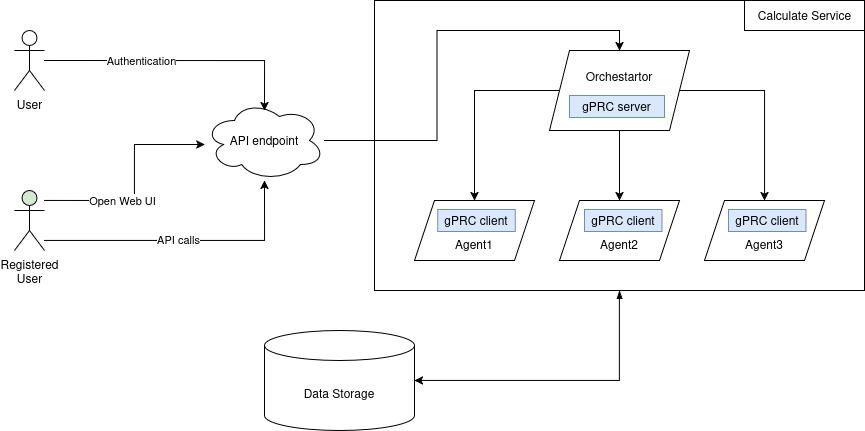

# Распределенный вычислитель арифметических выражений

-----

**Содержание**

- [Описание проекта](#описание)
- [Архитектура](#архитектура)
- [Структура](#структура)
- [Оркестратор](#оркестратор)
- [Агент](#агент)
- [Запуск](#запуск)
- [Примеры](#примеры)

## Описание
Проект по разработе распределенного вычислителя арифметических выражений. Проект является продолжением предыдущего сервиса "веб-калькулятор" и предназначен для расчета арифметических выражений. 

Пользователь вводит строку выражения, например 2 + 2 * 2 и хочет получить в ответ 6. 

Арифметическое выражение может содержать цифры, знаки сложения, знаки вычитания, знаки умножения и знаки деления. 

Для установки приоритета выполнения части выражения используются "круглые" скобки.

В данном проекте мы иммитируем сложные и громоздкие вычисления, поэтому любая операция: сложения, вычитания, умножения и деления выполняются долго. 

Поэтому каждое арифметическое действие выполняется отдельно, что позволяет горизонтально или вертикально масштабировать систему. Пользователь может с какой-то периодичностью уточнять у сервера "не посчиталось ли выражение"? Если выражение наконец будет вычислено - то он получит результат. 

## Архитектура

### Общая архитектура взаимодействия компонентов

### Веб-интерфейс
Веб-интерфейс состоит из шаблона страницы HTML, JavaScript файла и файла стилей CSS.
Для открытия веб-интерфейса вычислений, необходмо запустить сервис и перейти из браузера на страницу:
http://localhost:8080/home

Первая форма, которая открывается - это форма регистрации и входа пользователя

Для выполнения расчетов на калькуляторе используется форма вычислений:

### Сервис вычислений
  
Состоит из 2 элементов:
Сервер (Оркестратор), который принимает арифметическое выражение, переводит его в набор последовательных задач и обеспечивает порядок их выполнения. Далее будем называть его оркестратором.

Вычислитель (Агент), который может получить от оркестратора задачу, выполнить его и вернуть серверу результат. Далее будем называть его агентом.

### Структура базы данных
База данных реализована на базе реалиционной СУБД SQLlite и состоит из двух таблиц: users и expressions

### Взаимодействие внутри сервиса

## Структура
Проект состоит из файлов и папок: 

    - cmd/
        orchestrator/main - основной файл проекта
        agent/main - файл агента
    - cmd/
        orchestrator/main_test - тесты 
        agent/main_test - тесты агента
    - configs - конфигурационные файлы
    - docs - документация
    - internal/
        orchestrator - внутренние файлы проекта
        agent - внутренние файлы агента
    - pkg/
        auth - login, validation
        database - код для создания таблиц и работы с базой данных
        crypto/
            jwt - получение и верификация токена 
            password - генерация пароля
        models - модели        
        calculation - сервис расчета выражений
    - web/
        static - статические файлы веб-интерфейса
        template - шаблоны страниц html    
    - proto - файлы proto
    - README.MD - описание проекта
    - DESCRIPTION.MD - описание задачи
    docker-compose.yaml - инструкции для создания контейнеров
    Dockerfile_orchestrator - создание образа оркестратора
    Dockerfile_agent - создание образа агента

## Оркестратор
Сервер, который имеет следующие API-endpoint'ы

### Регистрация пользователя

Пользователь отправляет запрос POST 
    
    /api/v1/register { "login": , "password": }

В ответ получаем 200+OK (в случае успеха)

В противном случае - ошибка

### Авторизация пользователя

Пользователь отправляет запрос POST 
    
    /api/v1/login { "login": , "password": }

В ответ получаем 200+OK и JWT токен для последующей авторизации

### Вычисление арифметического выражения

    curl --location 'localhost/api/v1/calculate' \
    --header 'Content-Type: application/json' \
    --data '{
      "expression": <строка с выражение>
    }'

Коды ответа: 201 - выражение принято для вычисления, 422 - невалидные данные, 500 - что-то пошло не так

Тело ответа

    {
        "id": <уникальный идентификатор выражения>
    }

### Получение списка выражений

    curl --location 'localhost/api/v1/expressions'

Тело ответа

    {
        "expressions": [
            {
                "id": <идентификатор выражения>,
                "status": <статус вычисления выражения>,
                "result": <результат выражения>
            },
            {
                "id": <идентификатор выражения>,
                "status": <статус вычисления выражения>,
                "result": <результат выражения>
            }
        ]
    }

Коды ответа:

    200 - успешно получен список выражений

    500 - что-то пошло не так

    Получение выражения по его идентификатору

    curl --location 'localhost/api/v1/expressions/:id'

Коды ответа:

    200 - успешно получено выражение
    404 - нет такого выражения
    500 - что-то пошло не так

Тело ответа

    {
        "expression":
            {
                "id": <идентификатор выражения>,
                "status": <статус вычисления выражения>,
                "result": <результат выражения>
            }
    }

### Получение задачи для выполнения

    curl --location 'localhost/internal/task'

Коды ответа:

    200 - успешно получена задача
    404 - нет задачи
    500 - что-то пошло не так

Тело ответа

    {
        "task":
            {
                "id": <идентификатор задачи>,
                "arg1": <имя первого аргумента>,
                "arg2": <имя второго аргумента>,
                "operation": <операция>,
                "operation_time": <время выполнения операции>
            }
    }

### Прием результата обработки данных.

    curl --location 'localhost/internal/task' \
    --header 'Content-Type: application/json' \
    --data '{
      "id": 1,
      "result": 2.5
    }'

Коды ответа:

    200 - успешно записан результат
    404 - нет такой задачи
    422 - невалидные данные
    500 - что-то пошло не так

## Запуск
### Запуск проекта
Для установки проекта нужно клонировать папку проекта с github.com:
    
    git clone https://github.com/Zam62/go-final-task.git

Установите зависимости:

    go mod tidy

Создайте файл .env в корневой папке и укажите в нем параметры

Для запуска сервера нужно перейти в рабочую директорию проекта и выполнить запуск основного файла проекта:

    go run ./cmd/orchestrator/main.go

### Установка Docker
В проекте настроены Docker-compose файлы. 

    Docker версия 24.0 или выше
    Скачать и установить Docker: https://www.docker.com/get-started
    
   

### Запуск тестов
Для запуска тестов необходимо перейти в папку cmd и выполнить запуск тестов:

    cd cmd/
    go test -v -timeout 30s ./cmd 

## Примеры
### Сценарии использования

http://localhost:8080/api/v1/calculate

У сервиса один endpoint с url-ом .../api/v1/calculate. Пользователь отправляет на этот url POST-запрос с телом:

    {
        "expression": "выражение, которое ввёл пользователь"
    }

Для того, чтобы отправить запрос можно использовать Postman или curl. Пример вызова API с помощью утилиты curl:

    curl --location 'localhost:8080/api/v1/calculate' \
    --header 'Content-Type: application/json' \
    --data '{
      "expression": "2+2*2"
    }'

Пример вызова из Postman:
   

### Варианты ответов сервиса
В ответ пользователь получает HTTP-ответ с телом:

    {
        "result": "результат выражения"
    }

и кодом 200, если выражение вычислено успешно, либо HTTP-ответ с телом:

    {
        "error": "Expression is not valid"
    }

и кодом 422, если входные данные не соответствуют требованиям приложения — например, кроме цифр и разрешённых операций пользователь ввёл символ английского алфавита.

Ещё один вариант HTTP-ответа:

    {
        "error": "Internal server error"
    }

и код 500 в случае какой-либо иной ошибки («Что-то пошло не так»).
